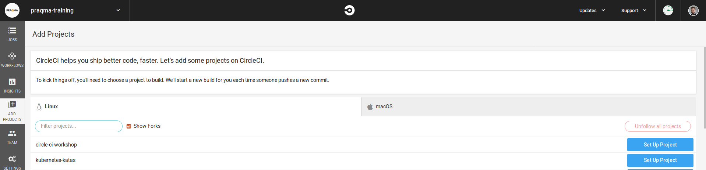
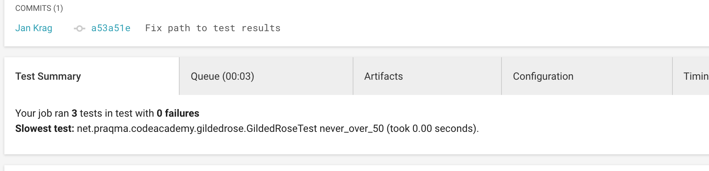
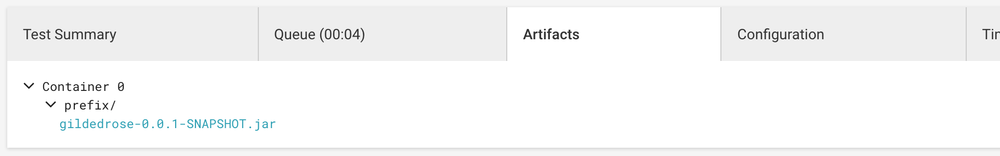
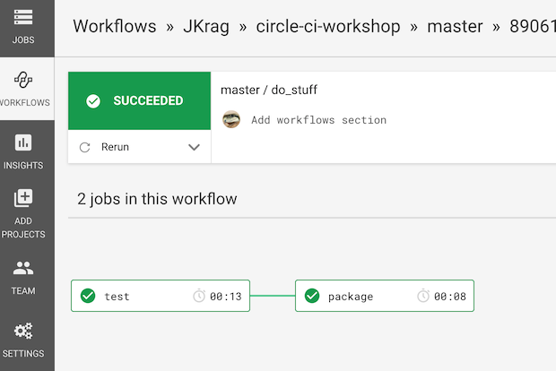

# CircleCI workshop

CircleCI is a continuous integration and build Software as a Service (SaaS).

This workshop will go through the basic steps in their system, making you able to make CI builds in the end.

> Note: at the time of writing, CircleCI has a free tier with 2,5 build hours per week. This should be enough for this exercise, but it's not an "all you can eat" buffet :)

## Coding Assignment

While the purpose is to learn CircleCI, there will also be some coding involved.

This is done just to give you some tangible code to work with:
Remember, this is not a programming exercise, but a CI one; code is only there so you have something to build :)

This repository comes with a gradle based java project from the start, but any language can be used. If you want to, just replace the java code with one of the other languages from this (GildedRose Refactoring Kata)[https://github.com/emilybache/GildedRose-Refactoring-Kata] repository.

Just clone the repository listed above and replace with your language of choice.

> Some of the tasks makes the assumption that you are using Gradle as your build system. If you replace the code, you need to find other ways to make test and code compilation, so its probably good to choose a languages you are comfortable with.

The description of the application can be read [here](gildedrose.md), but is not necessary to read just yet.

## Setup

You need to have your own fork of this workshop repository in order for the exercises to work.

Next, you need to login to CircleCI and add your project in there.

### Tasks

Setting up your repository is fairly simple;

* Fork this repository from the Github website into your own account, and then git clone the project from your own fork.
* [login to the CircleCI website](https://circleci.com/vcs-authorize/) using your GH handle.
* Add your forked repository to the CircleCI dashboard: 
* Leave the browser open and go back to the repository on your computer.
* Create a folder named .circleci and add a file called config.yml (so that the file path will be .circleci/config.yml relative to the root of the repository). In the terminal you can do it like this:

```bash
mkdir .circleci
touch .circleci/config.yml
```

Now we have set up the fundamentals to run a basic `hello world` build in CircleCI. However, running it would make CircleCI complain, as there is nothing in the file

## Making "hello world"

CircleCI is configured through the YAML file we just created.
In order for us to make the first `hello world` script, examine the following example:

```yaml
version: 2.0
jobs:
  build:
    docker:
      - image: alpine:3.7
    steps:
      - run:
          name: The First Step
          command: |
            echo 'Hello World!'
            echo 'This is the delivery pipeline'
```

The CircleCI config syntax is very straight forward. The trickiest part is typically indentation. Make sure your indentation is consistent. This is the single most common error in config. Let’s go over the nine lines in details

* Line 1: This indicates the version of the CircleCI platform you are using. `2.0` is the most recent version.
* Line 2-3: The `jobs` level contains a collection of arbitrarily named children. `build:` is the first named child in the jobs collection. In this case build is also the only job.
* Line 6-7: The `steps` collection is an ordered list of `run` directives. Each `run` directive is executed in the order in which it was declared.
* Line 8: The `name` attribute provides useful organizational information when returning warnings, errors, and output. The name should be meaningful to you as an action within your build process
* Line 9-11: This is the magic. The `command` attribute is a list of shell commands that represent the work you want done. The initial pipe, `|`, indicates a multi-line string containing more than one line of shell commands. Here line 10 will print out _Hello World!_ in your build shell and line 11 will print out _This is the delivery pipeline_

### Tasks

* Paste the example into `.circleci/config.yml`. Commit the file and push it to GitHub. Then go back to the CircleCI page and click *Start building* in the CI dashboard.

You should see something like this in the logs of CircleCI: (Note: The logs can be a bit hard to the first time :-), but give it a shot)

```bash
#!/bin/sh -eo pipefail
echo 'Hello World!'
echo 'This is the delivery pipeline'

Hello World!
This is the delivery pipeline
```

## Making a real pipeline

Up until now, we have only made sure that CircleCI can reach the configuration file, but not really made it do anything useful related to our actual code.

As a next step, we want CircleCI to actually clone our project, build the code and run the tests.

### Tasks

* Instead of using the image `alpine:3.7`, we now want to use a docker image that has both JDK and Gradle installed. CircleCI provides one called `circleci/openjdk:8-jdk`, so add that to your config file.
* Under the `steps` part, add a `- checkout` list item to the list before the existing ` - run:` item.
* Change the `run` command from the multi-line linux bash script to just run `gradle test` as the command.
* Commit and push the changes. CircleCI should automatically detect your new commit and build again. See that the build runs green and outputs this in the step log:

```bash
gradle test

Welcome to Gradle 5.3!

Here are the highlights of this release:
 - Feature variants AKA "optional dependencies"
 - Type-safe accessors in Kotlin precompiled script plugins
 - Gradle Module Metadata 1.0

For more details see https://docs.gradle.org/5.3/release-notes.html

Starting a Gradle Daemon (subsequent builds will be faster)
> Task :compileJava
> Task :processResources NO-SOURCE
> Task :classes
> Task :compileTestJava
> Task :processTestResources NO-SOURCE
> Task :testClasses
> Task :test

BUILD SUCCESSFUL in 6s
3 actionable tasks: 3 executed

```

Congratulations, you have now run the tests in your code!

## Add gradle test step

Once a test step has been added to the pipeline it would be nice to see the results of the tests without having to dig through output of the individual steps in CircleCI.

To store test results in CircleCI use the following syntax:

```YAML
- store_test_results:
    path: test-results
```

CircleCI supports a few different test report formats.
https://circleci.com/docs/2.0/configuration-reference/#store_test_results

Hint: The results of running `gradle test` are stored in a local directory: `build/test-results`.

If all works as intended, you should see something like .

## Run a few iterations on the code

Having your pipeline set up, now it is time to fix the software problem itself. Go back to [the gilded rose description to read about it](gildedrose.md)

## Building and storing artifacts

To build a jar file run `gradle jar`.

It is possible to store artifacts in CircleCI.

> This is not to be mistaken for artifact management, but it is a nice way to make files available in the CircleCI web interface.

To store artifacts use the following syntax:

```YAML
- store_artifacts:
    path: /code/test-results
    destination: prefix
```

More information:
https://circleci.com/docs/2.0/configuration-reference/#store_artifacts

When you have larger or more complex projects, you’ll want separate jobs to do separate things (i.e. build vs. test). Despite the fact our example project is super simple, we will divide the workload to demonstrate the functionality.

Up until now, we have had a job called `build` for the `gradle test`, but that is not really the correct phrasing. The only reason we have done this, is because CircleCI **requires** you to have one job called `build`

### Tasks

1. Add another `run` step to your `build` job that runs `gradle jar`, then add a step that stores the artifact it produces.

> Hint: The results of running `gradle jar` are actually stored in a local directory: `build/libs`

If all works out fine, your newest build should show something like:



## Workflow

So far we have only had one "job" called `build` even though it now has multiple steps.

It is also possible to use multiple jobs, organized in a what CircleCI calls a `Workflow`.

To use workflows we first have to define the jobs, i.e.:

```YAML
version: 2
jobs:
  job-1:
    ... steps and so on
  job-2:
    ... other steps
```

Then we have to declare a `workflows` section that runs the defined jobs.

```YAML
workflows:
  version: 2
  two_job_flow:
    jobs:
      - job-1
      - job-2
```

However, this simple example just runs the two jobs simultaneously, which is often not what we want.

Luckily, workflows let us do things like sequential flows, fan out, fan in and so on.

To run the two job sequentially we define a workflow where job-2 "requires" job-1 to have run before it starts.

```YAML
workflows:
  version: 2
  two_job_flow:
    jobs:
      - job-1
      - job-2:
          requires:
            - job-1
```

This also ensures that `job-2` is not run if `job-1` fails.

It is also possible to filter on branch names. This is useful to create a flow, where different branches go trough different jobs. For instance `feature/*` branches could be tested, while the `master` branch is both tested and an artifact is created and stored.

```YAML
workflows:
  version: 2
  feature_master:
    jobs:
      - test_feature:
          filters:
            branches:
              only:
                - feature/*
      - test_and_build_master:
          filters:
            branches:
              only: master
```

> All about workflows: https://circleci.com/docs/2.0/workflows/


### Tasks
Let's try to clean up our current build by utilizing a feature called workflows.

1. Make another job in the CircleCI config, that is a plain copy of the first one.
2. Rename the first job to `test`.
3. Make a `test` job that builds and tests the code, and stores the test results.
4. Make a `package` job that assembles the jar file and stores this artifact.

If you don't do anything else, you will notice that your CircleCI build fails, as it is still looking for a default job called `build` so let's add the needed `workflows` section. You should be able to do this based on the sample code above.

When you run this workflow in CircleCI, you will see a link with your workflow name at the top of the page.


Opening it should show something like:




## Making docker images


Often we also want to have our application packaged as a docker image for easy distribution. Lucky for us, CircleCI has nice support for Docker built in.

The following is an example of a job that builds a Docker image. Instead of specifying a `image` to run on, we now use a `machine: true` instruction to give us an environment where we can run actual docker commands:

```YAML
version: 2
jobs:
 dockerize:
   machine: true
   steps:
     - checkout
     # Login to docker
     - run: docker login -u $DOCKER_USER -p $DOCKER_PASS

     # build the application image
     - run: docker build -t company/app:$CIRCLE_SHA1 .

     # deploy the image
     - run: docker push company/app:$CIRCLE_SHA1
```

If you wanted to try this on the GilderRose project, you would have to complete the snippet, write a suitable `Dockerfile` and integrate this build step in the existing workflow.

> Hint: You can find lots of information about `$CIRCLE_SHA1` and the other environment variables provided by CircleCI in https://circleci.com/docs/2.0/env-vars/ and https://circleci.com/docs/2.0/env-vars/#built-in-environment-variables


# Extra topics

## Reusing build cache

CircleCI has a few different methods for reusing files and artifacts produced in a job, in downstream jobs or even in subsequent builds.

This is needed because each job in CircleCI is running in a separate docker container or machine, and by default no files are shared between these.

### Caching

The caching mechanism is persistent across multiple builds, and therefore a key is needed.

One example is to store downloaded dependencies in a cache, to avoid downloading the same dependencies over and over.
And since dependencies typically are defined in one central file, this file is hashed and used as a key:

```YAML
- save_cache:
    key: my-dependencies-{{ checksum "build.gradle" }}
    paths:
      - my-project/my-dependencies-directory
```

> https://circleci.com/docs/2.0/configuration-reference/#save_cache

Retrieving the cache is done with:

```YAML
- restore_cache:
    keys:
      - my-dependencies-{{ checksum "build.gradle" }}
```

> https://circleci.com/docs/2.0/configuration-reference/#restore_cache

CircleCI does NOT do anything to make sure the dependencies are actually downloaded when storing the cache. So it is important to use these keywords in the right order.

> All about caching: https://circleci.com/docs/2.0/caching/

### Workspaces

A `workspace` can be used to store files, which can then be retrieved and used by downstream jobs. Workspaces are only transferred within the same workflow, and not between builds like caching.

```YAML
- persist_to_workspace:
    root: /tmp/dir
    paths:
      - foo/bar
      - baz
```

> https://circleci.com/docs/2.0/configuration-reference/#persist_to_workspace

And to "attach" the workspace in a downstream job:

```YAML
- attach_workspace:
    at: /tmp/workspace
```

> https://circleci.com/docs/2.0/configuration-reference/#attach_workspace

This is very useful to store a build artifact when it is first build, to avoid having to rebuild the artifact in downstream jobs.

> All about workspaces: https://circleci.com/docs/2.0/workflows/#using-workspaces-to-share-data-among-jobs
